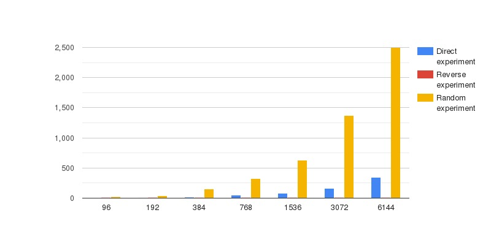

[](https://travis-ci.com/DaniilRyb/lab-02-cache)

# Лабораторная работа №2

В большинстве современных ПК используется следующая иерархия памяти:
| Тип | Скорость доступа | Размер |
| - | - | - |
| Регистры процессора | порядка 1 такта | несколько сотен или тысяч байт |
| Кэш процессора L1 | порядка несколько тактов | десятки килобайт |
| Кэш процессора L2 | от 2 до 10 раз медленнее L1 | от 0.5Mb |
| Кэш процессора L3 | около сотни тактов | от нескольких мегабайт до сотен |
| Кэш процессора L4 (Intel 5 поколения) | несколько сотен тактов | >100Mb |
| ОЗУ | от сотен до тысяч тактов | от нескольких гигабайт до нескольких терабайт |
| Дисковое хранилище | миллионы тактов | до нескольких сотен терабайт |
| Третичная память | до нескольких секунд или минут | практически неограничен |

### Задача

Используя описанный выше способ обхода провести исследование зависимости времени чтения одного элемента массива от размера массива.

Обход совершить тремя способами:
- **прямой** (0, 16, 32, 48, ...);
- **обратный** (..., 64, 48, 32, 16, 0);
- **случайный** (например 32, 128, 0, 16, 48, 64 и т.д.).

Каждое исследование включает в себя серию эксперементов c определенными размерами.

Количество экспериментов в серии определяется следующим образом:

```cpp
1/2 * cache_sizes['1'] < 2^x < 2^(x+1) < ... < 2^(x+n) < 3/2 * cache_sizes['max']
```

### Результаты

```
Ниже представлен формат и пример отчета:
investigation
  travel_order Direction
 experiments
 -experiment:
   number 1
   input_data:
     buffer_size: 96 kb
   results:
     direction: 3.72357 ms
   number 2
   input_data:
     buffer_size: 192 kb
   results:
     direction: 7.70292 ms
   number 3
   input_data:
     buffer_size: 384 kb
   results:
     direction: 15.4227 ms
   number 4
   input_data:
     buffer_size: 768 kb
   results:
     direction: 49.9048 ms
   number 5
   input_data:
     buffer_size: 1536 kb
   results:
     direction: 81.9549 ms
   number 6
   input_data:
     buffer_size: 3072 kb
   results:
     direction: 165.36 ms
   number 7
   input_data:
     buffer_size: 6144 kb
   results:
     direction: 348.981 ms


 investigation
  travel_order Reverse
 experiments
 -experiment:
   number 1
   input_data:
     buffer_size: 96 kb
   results:
     direction: 0.005735 ms
   number 2
   input_data:
     buffer_size: 192 kb
   results:
     direction: 0.005584 ms
   number 3
   input_data:
     buffer_size: 384 kb
   results:
     direction: 0.005654 ms
   number 4
   input_data:
     buffer_size: 768 kb
   results:
     direction: 0.005584 ms
   number 5
   input_data:
     buffer_size: 1536 kb
   results:
     direction: 0.005614 ms
   number 6
   input_data:
     buffer_size: 3072 kb
   results:
     direction: 0.005594 ms
   number 7
   input_data:
     buffer_size: 6144 kb
   results:
     direction: 0.005644 ms


 investigation
  travel_order Random
 experiments
 -experiment:
   number 1
   input_data:
     buffer_size: 96 kb
   results:
     direction: 25.5944 ms
   number 2
   input_data:
     buffer_size: 192 kb
   results:
     direction: 43.7489 ms
   number 3
   input_data:
     buffer_size: 384 kb
   results:
     direction: 148.22 ms
   number 4
   input_data:
     buffer_size: 768 kb
   results:
     direction: 327.787 ms
   number 5
   input_data:
     buffer_size: 1536 kb
   results:
     direction: 629.019 ms
   number 6
   input_data:
     buffer_size: 3072 kb
   results:
     direction: 1367.51 ms
   number 7
   input_data:
     buffer_size: 6144 kb
   results:
     direction: 2499.63 ms
```
### Общий график с результатами
 
